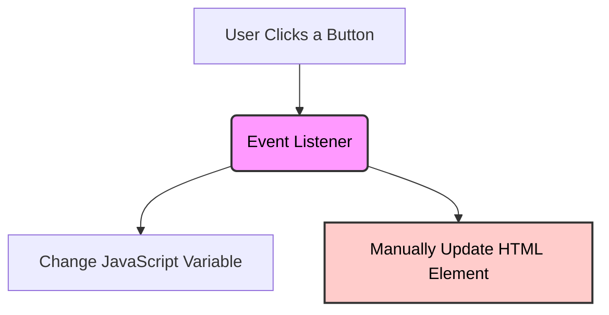
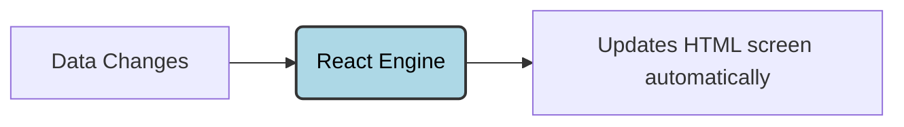
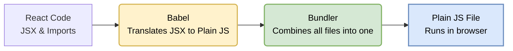

# JavaScript to React Foundation (Conceptual View)

This file helps you understand why we use React, how JavaScript works in the browser, and the basic JavaScript rules you need for React.

---

## 1. Why React Exists

When building websites with plain JavaScript (Vanilla JS), writing code gets hard as your app grows.

### The Vanilla JS Problem
* **Manual UI Updates:** You have to find each HTML element yourself and change it (for example: `document.getElementById("btn").innerText = "Clicked"`).
* **Manual Data Sync:** If your data changes, your UI does not update automatically. You have to write code to update the UI every time the data changes.
* **Easy to Break:** If you forget to update one place, your UI and data will mismatch.



---

### The React Solution
React uses a simple rule:

$$\text{UI} = f(\text{State})$$

This means your **UI (User Interface)** is just a result of your **State (Data)**.

* **Declarative UI:** You only describe what the UI should look like based on the data. You do not tell the browser *how* to change it step-by-step.
* **Automatic Updates:** You only update the **State (Data)**. React will automatically find what changed and update the browser screen for you.



---

## 2. Where JavaScript Runs

JavaScript is a programming language. It is not limited to the browser.

* **Browser:** Used to build websites and handle user clicks.
* **Node.js:** Used to run JavaScript on servers (computers).
* **React Native:** Used to build mobile apps (for iOS and Android).

> **Key Rule:** JavaScript is the language that runs your code. React is a tool built on top of JavaScript to make building screens easier.

---

## 3. How React Code Runs in the Browser

Web browsers only understand three things:
1. **HTML** (Structure)
2. **CSS** (Style)
3. **Plain JavaScript** (Standard ES5/ES6)

React code uses special features like **JSX** (writing HTML-like code inside JavaScript) and **Modules** (import/export). Browsers cannot read this directly.

We need a **Build Step** to convert React code into plain JavaScript.



* **Babel:** A tool that converts modern JS and JSX into old plain JS that all browsers understand.
* **Bundler (like Vite or Webpack):** A tool that merges all your small files into one or two files.
* **Takeaway:** The browser never runs your raw React code. It runs the translated plain JavaScript code.

---

## 4. Import / Export (Sharing Code)

In modern JavaScript, you can split your code into multiple files. This keeps code clean and reusable.

We have two ways to share code:

### A. Named Export (Multiple things per file)
Use this when you want to export multiple variables or functions from a single file.

* **Export:** Put the word `export` in front of each variable or function.
* **Import:** You must use curly braces `{ }` and write the exact name.

```javascript
// math.js
export const add = (a, b) => a + b;
export const sub = (a, b) => a - b;

// App.js
import { add } from "./math"; // We pick only what we need
```

### B. Default Export (One main thing per file)
Use this when a file only has one main component or function.

* **Export:** Use `export default` before the function or component.
* **Import:** Do **not** use curly braces `{ }`. You can rename it to anything you want.

```javascript
// User.js
export default function User() {
  return "This is the main user component";
}

// App.js
import UserComponent from "./User"; // No curly braces, and we can rename it!
```

---

## 5. Storing Data: `var`, `let`, and `const`

How you declare variables defines how they behave.

### `var` (Old Way - Avoid)
* It can be re-declared (you can write `var x = 10` and `var x = 20` in the same place without errors).
* It leaks out of blocks. It is not limited to `if` statements or loops.
* **Avoid using this** because it causes unexpected bugs.

### `let` (Modern Way - Use when value changes)
* Used when the value of the variable will change later.
* Limited to blocks `{ }`. It cannot be read outside the curly braces it was created in.
* Cannot be re-declared in the same place.

```javascript
let count = 1;
count = 2; // Allowed!
```

### `const` (Default Way - Use for most React variables)
* Used when the reference to the value should not change.
* Limited to blocks `{ }`.
* Cannot be reassigned.

```javascript
const name = "Ali";
// name = "Ahmed"; // ❌ Error! Cannot reassign.
```

#### The `const` Object Exception
If you use `const` with an Object or Array, you can still change the values *inside* the object. You just cannot assign a completely new object or array to it.

```javascript
const user = { name: "Ali" };

user.name = "Ahmed"; //  Allowed! (We changed the value inside)
// user = { name: "Ahmed"; } // ❌ Error! (We tried to replace the whole object)
```

### Why React Prefers `const`
1. **No Accidental Changes:** It ensures components and fixed values are not overwritten by mistake.
2. **Predictable Code:** Knowing that a variable will not change makes it much easier to debug.

```javascript
// React components are always declared using const
const App = () => {
  return <h1>Hello React!</h1>;
};
```

---

## 6. Arrow Functions

Arrow functions are a shorter way to write functions in JavaScript. 

### Why React Uses Arrow Functions
* **Clean and Short:** Saves you from writing the `function` keyword repeatedly.
* **No Private `this`:** They do not create their own `this` context. They inherit `this` from the code around them. This is very helpful in React.

### Basic Comparison
Instead of:
```javascript
function add(a, b) {
  return a + b;
}
```
You can write:
```javascript
const add = (a, b) => a + b;
```

### Key Rules of Arrow Functions

#### A. Anonymous Functions (No Name)
Arrow functions are often written without a name when passed as an argument to another function (like a timer or click handler).
```javascript
setTimeout(() => {
  console.log("Hello after 1 second");
}, 1000);
```

#### B. Omit Parentheses (For 1 Parameter)
If a function only takes **one** parameter, you can remove the parentheses `()`.
```javascript
const square = x => x * x;
```

#### C. Implicit Return (No curly braces `{}`)
If your function is only one line, you can omit the curly braces `{}` and the `return` keyword. The value is returned automatically.
```javascript
const add = (a, b) => a + b; // Automatically returns a + b
```
If you use curly braces `{ }`, you **must** write `return` manually:
```javascript
const add = (a, b) => {
  return a + b; // Manual return is required here
};
```

#### D. The `this` Keyword & Constructors
* **No `this` binding:** Standard functions have their own `this`. Arrow functions do not. They borrow `this` from where they were defined.
* **No `new` keyword:** Arrow functions cannot be used as constructors to create objects.
```javascript
const Person = () => {};
const p = new Person(); // ❌ Error! Cannot use 'new' with arrow functions.
```

---

## 7. Arrays and Key Array Methods

An array is an ordered list of values. 
```javascript
const numbers = [1, 2, 3];
```
In React, we use arrays constantly to display lists on the screen, filter search results, and update data.

### Important Array Methods for React:

#### A. `map()` (Most Important)
Transforms every item in an array and returns a **new array** of the same length.
* **React Use:** Used to turn a data array into a list of HTML elements on the screen.
```javascript
const numbers = [1, 2, 3];
const doubled = numbers.map(x => x * 2); // [2, 4, 6]
```

#### B. `filter()`
Checks every item and returns a **new array** containing only the items that pass a test.
* **React Use:** Used to delete items or filter search lists.
```javascript
const numbers = [1, 2, 3, 4];
const evenNumbers = numbers.filter(x => x % 2 === 0); // [2, 4]
```

#### C. `findIndex()`
Finds the index (position) of the first element that passes a test. Returns `-1` if not found.
```javascript
const colors = ["red", "green", "blue"];
const index = colors.findIndex(color => color === "green"); // 1
```

#### D. `reduce()`
Combines all items in an array into a single value (like a sum or a single object).
```javascript
const numbers = [1, 2, 3];
const sum = numbers.reduce((accumulator, current) => accumulator + current, 0); // 6
```

#### E. `push()` (Avoid in React State)
Adds an item to the end of the original array.
* **Warning:** `push()` modifies (mutates) the original array. In React, mutating arrays directly is bad practice. We prefer methods like `map` and `filter` because they return new arrays.
```javascript
const items = [1, 2];
items.push(3); // [1, 2, 3] (Mutates the original array)
```

---

## 8. Destructuring (Extracting Data)

Destructuring is a shortcut to extract properties from objects or values from arrays into separate variables.

### A. Object Destructuring
Instead of writing `user.name` and `user.age` multiple times:
```javascript
const user = { name: "Ali", age: 20 };

// Extract name and age:
const { name, age } = user;

console.log(name); // "Ali"
console.log(age);  // 20
```
* **React Use:** Very common to extract properties (`props`) passed to components.

### B. Array Destructuring
Extracts items based on their position in the array.
```javascript
const coordinates = [10, 20];

// Extract first and second items:
const [x, y] = coordinates;

console.log(x); // 10
console.log(y); // 20
```
* **React Use:** Used by React hooks like `useState` (e.g., `const [count, setCount] = useState(0)`).

---

## 9. Spread Operator (`...`)

The spread operator (`...`) lets you copy, merge, or expand arrays and objects.

### A. Copying and Adding to Arrays
In React, we do not mutate arrays. We make copies instead.
```javascript
const original = [1, 2];

// Make a copy:
const copy = [...original]; // [1, 2]

// Add a new element while copying:
const updated = [...original, 3]; // [1, 2, 3]
```

### B. Merging Objects
You can copy an old object and add or overwrite properties in a new object.
```javascript
const user = { name: "Ali" };

// Copy user and add age:
const updatedUser = { ...user, age: 20 }; // { name: "Ali", age: 20 }
```
* **React Use:** Essential for updating React state objects without mutating the original state.

---

## 10. Dialogs vs. Logging: `console.log`, `alert`, and `prompt`

| Method | Purpose | How it works | React Application Relevance |
| :--- | :--- | :--- | :--- |
| **`console.log()`** | Developer debugging | Prints text in browser console. Invisible to users. | **High:** Used constantly during development to debug state/props. |
| **`alert()`** | User notifications | Shows a popup message. Stops all page action until closed. | **None:** Annoying UI and blocks the main thread. Avoid in real apps. |
| **`prompt()`** | Getting user input | Shows a popup with a text field. Stops all page action. | **None:** Poor user experience. We use HTML inputs/forms instead. |

---
